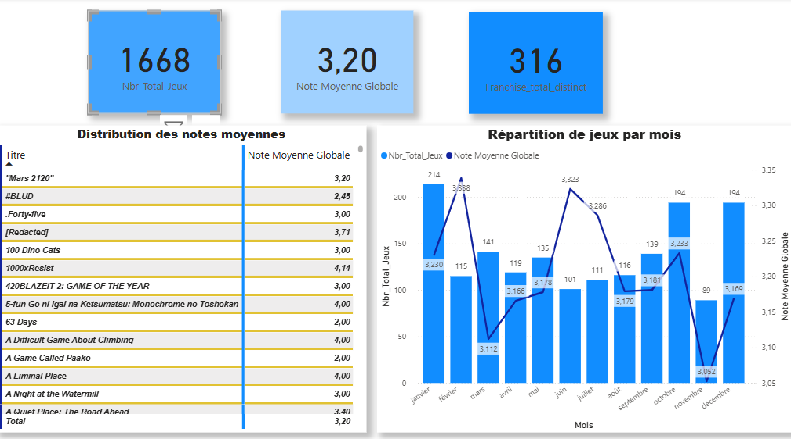
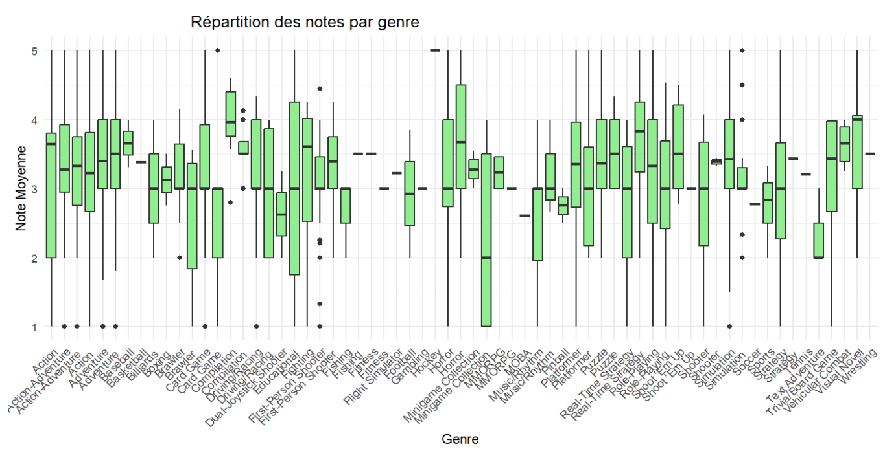
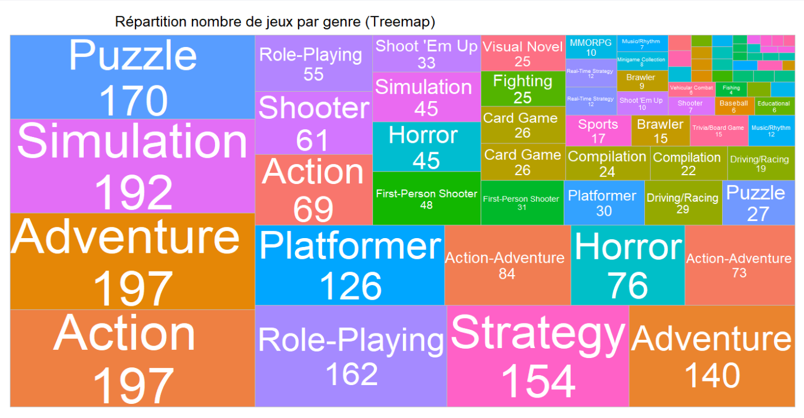
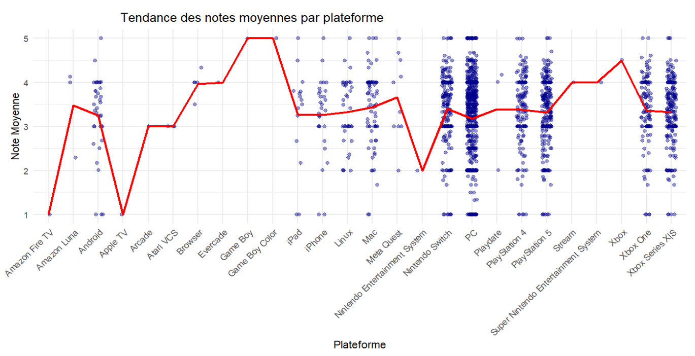

# Rapport d'analyse : Jeux sortis en 2024 (Grouvee)

Ce rapport présente une analyse des jeux vidéo sortis en 2024, basée sur les données collectées sur le site Grouvee. Il a pour but de mieux comprendre les tendances de l'industrie vidéoludique de cette année-là à travers différents indicateurs : notes moyennes, genres populaires, répartition par plateforme, etc.

## Objectifs de l'étude

- Identifier les genres et types de jeux les plus populaires en 2024.
- Étudier la distribution des notes moyennes données par les utilisateurs.
- Comparer les performances des jeux selon les plateformes.
- Explorer l'impact d'une franchise sur les évaluations.
- Appliquer des techniques de clustering pour détecter des groupes de jeux similaires.
- Vérifier les corrélations entre certaines variables clés.

---

## 1. Tendance générale des notes

KPI :

Courbe de densité des notes :

**Analyse :** 
> Sur les 1668 jeux analysés, la note moyenne globale est de 3,20 avec 316 franchises distinctes identifiées. La production mensuelle de jeux varie, avec un pic en janvier, mais les mois les plus prolifiques ne sont pas nécessairement ceux où la note moyenne est la plus élevée.

Boxplot général des notes moyennes :

**Analyse :**
> Les notes moyennes des jeux sont principalement concentrées entre 2 et 4, comme le montre la courbe de densité et le boxplot. Le tableau de bord récapitulatif confirme cette tendance avec une note moyenne globale de 3,20 sur 1668 jeux, et une variation mensuelle assez stable.
---

## 2. Comparaison des genres

Boxplot des notes par genre :

Répartition des jeux par genre :

**Analyse :**
> Les genres les plus populaires en termes de volume sont Adventure, Action et Simulation, chacun regroupant près de 200 jeux. En revanche, les notes moyennes varient fortement selon les genres, avec certains comme Platformer ou Visual Novel montrant des tendances plus homogènes, tandis que d'autres présentent une forte dispersion, révélant des niveaux de qualité hétérogènes.

---

## 3. Plateformes et notes

Note moyenne par plateforme :

## 3.1 Fréquences 
Nombre de plateformes par jeux

**Analyse :**
> Le nombre de jeux varie fortement selon les plateformes, avec une **domination écrasante du PC**, suivi des consoles modernes comme la **Nintendo Switch** et les **PlayStation**. En revanche, on constate une forte concentration des notes autour de 3 à 4 pour la plupart des plateformes, avec une moyenne légèrement plus élevée sur des consoles comme Game Boy ou Xbox
---

## 4. Clustering des jeux

Clustering basé sur la note moyenne et le nombre de plateformes :

**Analyse :**
> Trois profils de jeux distincts : les jeux multi-plateformes bien notés (cluster 3), les jeux peu notés souvent sur peu de plateformes (cluster 1), et un groupe intermédiaire modérément bien noté et peu distribué (cluster 2).

---

## 5. Corrélation

Matrice de corrélation entre note moyenne et nombre de plateformes :

**Analyse :**
> La popularité d’un jeu est fortement liée au nombre d’évaluations reçues, avec une corrélation de 0.87. Une relation modérée existe aussi entre la popularité et la note moyenne, suggérant que les jeux mieux notés attirent davantage d’intérêt.

---

## 6. Évolution temporelle

Évolution mensuelle du nombre de jeux et de la note moyenne :

**Analyse :**
> Les mois de janvier, octobre et decembre montrent des pics de sorties. Les notes restent globalement stables avec de légères hausses selon les mois.

---

## 7. Franchises

Comparaison des notes entre jeux avec ou sans franchise :

## 8. Régression linéaire

Comparaison Note Moyenne vs Nombre de plateformes

**Analyse :**
> Les jeux issus d'une franchise tendent à obtenir des notes légèrement plus élevées que ceux qui n'en ont pas. D'ailleurs, plus un jeu est disponible sur un grand nombre de plateformes, plus sa note moyenne semble légèrement augmenter, suggérant une corrélation positive modérée.

---

## Conclusion

Cette étude exploratoire met en lumière plusieurs dynamiques du marché vidéoludique 2024. Elle montre que certaines plateformes ou genres sont mieux notés que d'autres, que les franchises influencent la perception des utilisateurs, et que des patterns intéressants émergent grâce aux techniques de clustering.

> Des études futures pourraient inclure des données historiques, intégrer le temps de jeu ou encore les commentaires textuels pour enrichir cette analyse.

---

**Fait avec :** R, ggplot2, dplyr, fviz_cluster, treemapify
